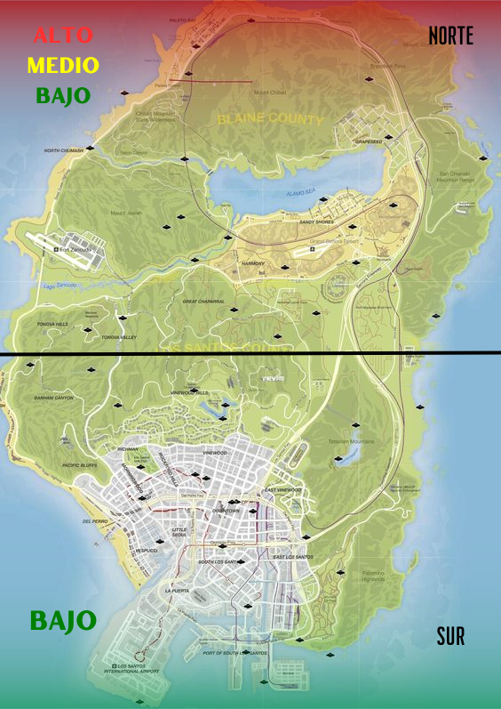

# 🏞️ Definición de Zonas

## Zonas Seguras

Entendemos por zona segura aquel lugar  publico/privado en el cual no se puede ejercer ningún acto de índole delictiva que afecte a los usuarios que se encuentren dentro de esta misma.

**Si se inicia un&#x20;**<mark style="color:red;">**rol agresivo o rol de peso**</mark>**&#x20;fuera de&#x20;**<mark style="color:green;">**zona segura**</mark>**&#x20;y este llega a&#x20;**<mark style="color:green;">**zona segura**</mark>**&#x20;siempre se tendrá que seguir y no será sancionado.**

* Hospital
* Menú de interacción.
* LSPD


TODA ZONA DE TRABAJOS LEGALES. _<mark style="color:red;">**La comisión de cualquier acto delictivo dentro de los límites de una zona segura está terminantemente prohibida.**</mark>_ Excepciones serán consideradas solo en el caso de roles que hayan iniciado fuera del perímetro designado. _<mark style="color:red;">**La violación de esta normativa resultará en sanciones administrativas correspondientes.**</mark>_


## Zonas de Entorno Seguro

Estas zonas públicas o privadas son lugares donde están protegidos por entorno, como por ejemplo, una comisaria, un hospital, la base militar, etc.

## Zonas Roja / Ilegales

Entendemos como zona roja una zona conflictiva donde se puede realizar cualquier tipo de actividad ilícita.

<mark style="color:red;">**Las zonas rojas se designan como áreas de farmeo, cosecha y procesamiento de drogas, así como el HQ de organizaciones delictuales.**</mark>

<mark style="color:red;">**Se puede disparar a abatir (siempre y cuando la persona no esté dentro del vehículo, en caso de estar dentro del mismo se puede disparar a pinchar ruedas).**</mark>

En estas áreas, los participantes podrán ser abatidos sin previo aviso, y se permite el uso de cualquier calibre. El comando /entorno no será necesario en estas zonas, excepto al ingresar, salir de zona roja, realizar actividades de farmeo de drogas, cosecha y procesamiento o iniciar un rol de secuestro, en cuyo caso su uso será obligatorio.

Los EMS podrán asistir a los llamados pero podrán ser sometidos o forzados a atender a los criminales. IMPORTANTE Después de recibir tratamiento por parte de un **EMS**, al criminal se le prohíbe regresar a esa zona por un periodo de espera de 10 minutos. Al descubrir a la persona regresando a una zona roja antes de transcurrir el tiempo estipulado, se aplicarán sanciones administrativas correspondientes.

El abusar de estas zonas para hacer DM o el forzar que personas entren en estas zonas para luego matarlas, robarles, etc. será sancionado administrativamente.

Está completamente prohibido el toxiquear mediante en el chat OOC, esto puede ser considerado grave dependiendo de lo que se diga y conlleva una sanción.


Está completamente prohibido el campeo en estas zonas.


Al iniciar un rol DENTRO de ZONA ROJA y terminarlo FUERA de ZONA ROJA, se puede cachear a los abatidos tirando 1 entorno para todos los cuerpos abatidos.

Civiles podrán asistir como máximo de 3 personas a <mark style="color:red;">**zona roja**</mark>**.**

Como organización delictual podrán asistir un máximo de 15 participantes a <mark style="color:red;">**zona roja**</mark>.

Se prohíbe revisar o robar el DNI de una persona abatida en zona roja siendo **CIVIL (Exclusivo OD).**

Está totalmente prohibido el uso de cascos, al interior de **zonas rojas** tales como farmeo/cosecha/procesado de drogas/armas.

Se permite cachear a abatidos dentro de estas zonas rojas con los comandos /me y /do correspondientes.

Cuando se lleva a cabo un robo a un cuerpo abatido dentro de una Zona Roja, es crucial realizar los comandos /me y /do pertinentes, similar a un asalto a civiles. La única diferencia en que la víctima se encuentra abatida. La persona abatida **tendrá un plazo máximo de tiempo de 20 segundos** para responder a los comandos /do. En caso de exceder este límite, la otra persona estará autorizada a llevar a cabo el robo de manera forzada.

Es posible robar a oficiales abatidos, retirando todas sus pertenencias, excluyendo únicamente sus armamentos institucionales. Armamento LSPD: **Porra policial, taser, pistola de combate, linternas y tablet policial**. "**Tampoco se podrá retirar alimentos.**

<figure><figcaption></figcaption></figure>

## Restricción de uso de barrios de bandas para escape

Por normativa de _Rol de Entorno_, se prohíbe a los jugadores utilizar los territorios o barrios controlados por otras bandas o facciones como ruta de escape en situaciones que involucren persecuciones policiales, conflictos armados, o cualquier otro evento hostil.

Esta restricción se establece con el objetivo de preservar la coherencia y realismo del entorno urbano, así como para evitar el uso indebido de zonas específicas del mapa sin justificación válida dentro del rol.


El incumplimiento de este punto conllevara una sanción.

